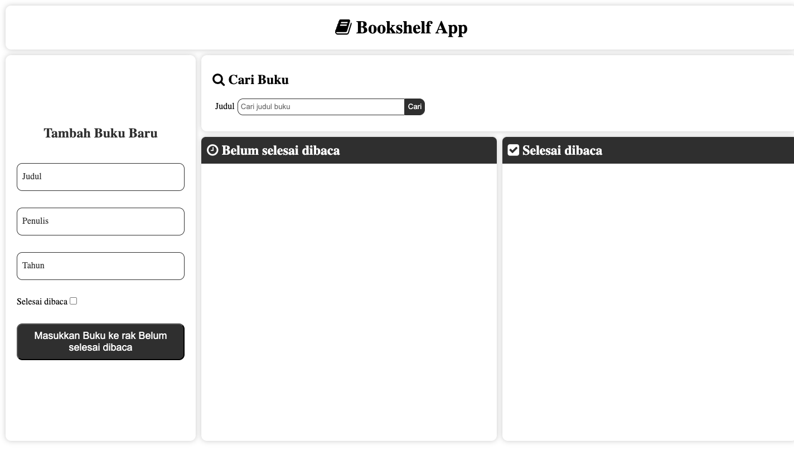

# 📚 Bookshelf App

Bookshelf App is a simple web application that helps users manage their reading list by adding, organizing, and tracking books they have read or plan to read.

## ✨ Features
- Add new books
- Mark books as completed or unfinished
- Delete books from the list
- Save data using Local Storage

## 🛠 Built With
- HTML
- CSS
- JavaScript

## 🚀 Live Demo
https://fauzansyaifullohfatah.github.io/bookshelf-app/

## 📸 Preview

## 📝 Notes
This project was created as a learning project and submission.
